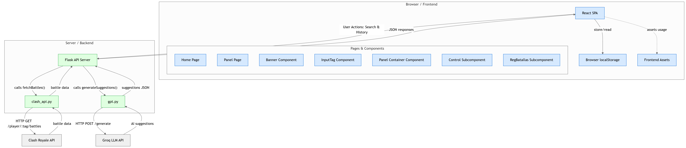

# Sugerencias CR

Aplicación web que analiza las batallas recientes de un jugador de Clash Royale y le entrega una sugerencia personalizada para mejorar su estrategia. Utiliza IA para ofrecer análisis inteligentes y adaptativos.

### Tecnologías usadas
- **Frontend:** React + TypeScript + HTML5 + CSS
- **Backend:** Python + Flask
- **IA:** API de Groq (modelo LLM)
- **Datos:** API oficial de Clash Royale
- **Estado local:** `localStorage` (por ahora sin base de datos)
  
### Funcionalidades principales

* Búsqueda por tag de jugador.
* Historial de batallas.
* Panel de análisis.
* Generación de sugerencias personalizadas con IA.

### Estructura del proyecto

### Demostración

